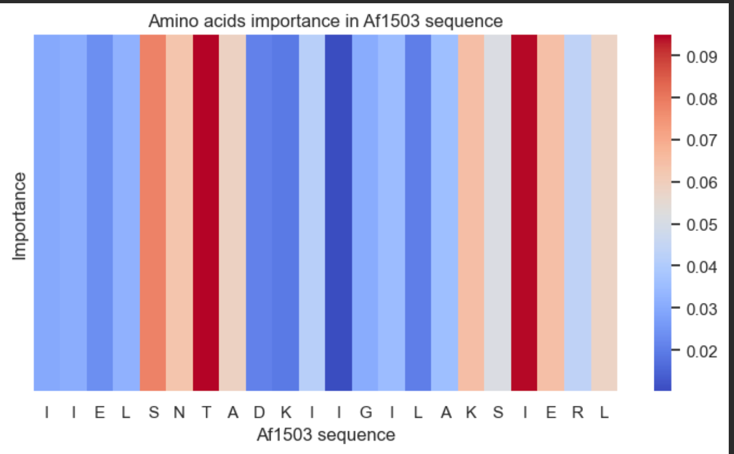

# HAMPred


This is library used to train and predict structural features of HAMP domains from the sequence. 
Currently, it contains models which can predict crick angles deviation between N and C helices and 
crick angle per residue.

## Table of contents
* [ Installation ](#Installation)
* [ Models ](#Models)
* [ Usage ](#Usage)
* [ Remarks ](#Remarks)

## Installation
For the local use, use the `pyproject.toml` file or `environment.yml` to create a new conda environment.  \

**poetry**

```
pip install petry
poetry install
# Starts virtualenv console (hamp_pred and hamp_train commands will be available in console)
poetry shell
```

**conda**
```
conda env create -f environment.yml
```

**docker**

```
docker compose up -d --build
```

## Models

1. **hamp_rot**
 * Can be used when we know sequences for N and C helices
 * Predicts crick angle difference between N and C helices per residue
 * Column with predicted crick angle difference: predicted_rotation

2. **hamp_crick_single_sequence**
 * Can be used when we do not know where N and C helices are located in HAMP domain
 * Input is whole sequence of HAMP domain
 * Automatically detects helices and predicts crick angle for them per residue
 * Predicts crick angle difference between N and C helices per residue
 * Column with predicted crick angle difference: predicted_rotation

3. **hamp_crick_ensemble**
 * Can be used when we do not know where N and C helices are located in HAMP domain
 * First it applies **hamp_crick_single_sequence** then **hamp_rot**
 * Column with predicted crick angle difference: predicted_rotation

## Example Usage
After installing with poetry we can access prediction script from command line under `hamp_pred`

### Example command line:
```bash
# specify sequences and save results to dd.tsv using hamp_crick_ensemble
 hamp_pred --test_sequences LTITQPLKELVQGVQRIAQGNFKQRVTLAYPGEIGELITSFNLMAQRLQSYEE --save_path dd.tsv --model_name hamp_crick_ensemble
 # specify sequences in FASTA file and save results to dd.tsv using hamp_crick_ensemble
 hamp_pred --test_data data/input/example_hamp_seq.fasta --save_path dd.tsv --model_name hamp_crick_ensemble
```

### Example server (can be started using docker compose)

```python
import json
import time

import requests
sequences_for_prediction = {
  "sequences": [
    "LTITQPLKELVQGVQRIAQGNFKQRVTLAYPGEIGELITSFNLMAQRLQSYEE"
  ]
}
host = 'http://127.0.0.1:8080/api'
endpoint = '/models/{model_name}/predict'
#prediction based on raw sequence (no assigned helices) 9ba1fe78-0424-4c5c-a875-9784372e1aa1
task_id = requests.post(f'{host}{endpoint}'.format(model_name='hamp_crick_ensemble'),
                        json=sequences_for_prediction).json()
results = requests.get(f'{host}/tasks/status/{task_id}')
while results.status_code != 200:
  results = requests.get(f'{host}/tasks/status/{task_id}')
  time.sleep(1)
  print("Waiting for results")
print("PREDICTED helices:")
print(results.json()[0]['detected_helices'])
print("PREDICTED helices ranges:")
print(results.json()[0]['detected_helix_ranges'])
print("PREDICTED crick angle:")
print(results.json()[0]['prediction'])
print("PREDICTED rotation angle:")
print(results.json()[0]['predicted_rotation'])
```

### Example in code

```python
from hamp_pred.src.predictor import Predictor
pred = Predictor('hamp_crick_ensemble')
result = pred.predict('LTITQPLKELVQGVQRIAQGNFKQRVTLAYPGEIGELITSFNLMAQRLQSYEE')
```

### Example in code (amino acids importance)
```python
from hamp_pred.src.predictor import Predictor
import pandas as pd
import matplotlib.pyplot as plt
import seaborn as sns
test_data = pd.read_pickle('../data/input/full_pdb_hamp.p')
test_data.rename(columns={'seq1':'n_seq', 'seq2':'c_seq', 'n_list':'n_crick_mut', 'c_list':'c_crick_mut'}, inplace=True)
model = Predictor('hamp_rot')
af_seq_short = test_data.loc['2l7h.pdb']['n_seq'][1:-1] + test_data.loc['2l7h.pdb']['c_seq'][1:-1]
importance = model.process_data([af_seq_short], kind='importance_describer', out_kind='heatmap', mode='replacement', diff_metric='t')

fig, ax = plt.subplots()

sns.heatmap(importance[0], cmap='coolwarm', xticklabels=importance[1], ax=ax, yticklabels=[])
ax.set_xlabel('Af1503 sequence')
ax.set_ylabel('Importance')
ax.set_title("Amino acids importance in Af1503 sequence")
```

This code will generate image  with impact on predcited rotation assigned to 
each amino acid from Af1503 N and C helices.
Such an analysis can be used for example to find position which can be substituted with different
amino acid to change predicted rotation and thus that also signal transduction activity of given HAMP domain.

## Remarks

Founding

This work was supported by Diamentowy Grant.